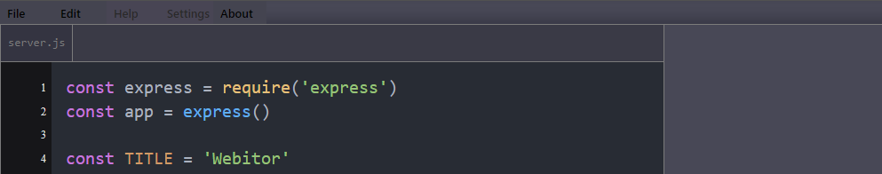

# Webitor

## About

Webitor is a browser-based code editor/project manager I made for use at a non coding job that didn't allow software on work computers. I just wrapped it in a simple node server for exposition.

> [!IMPORTANT]
> This project is currently in ***spaghetti supreme mode*** with limited functionality.

Actively being tested in the following browsers

| Browser       | Version        |
| ------------- | -------------: |
| DuckDuckGo    | 0.83.1         |
| Chrome        | 125.0.6422.142 |
| Safari        | 17.5           |

## Coding Style Guide
Refer to the [Coding Style Guidelines](docs/GUIDELINES.md) for conventions used in this project

## Task List

- [ ] Add tasks to task list

## Dependencies / Credits

| Dependency    | Uses                  | Link                                     |
| :-            |                   :-: |                                       -: |
| zip.js        | handling zip files    | https://gildas-lormeau.github.io/zip.js  |
| Highlight.js  | syntax highlighting   | https://highlightjs.org                  |
